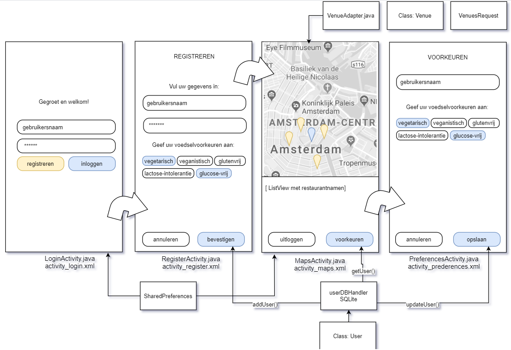
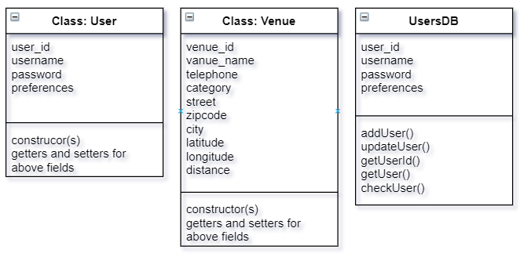

<h1>Design document</h1>

<h3>Advanced sketch</h3>

- When the application is opened for the first time, the user sees a page with "instructions" on what the application's features are. The user is also given the information that they can find these instruction if needed. The next activity will begin after a button click.
- Then, the application is prepared for different scenarios (in neither case will the instruction be shown again, only when the user specifically asks for it)
-In case the user was already logged in (checked in sharedpreferences) the user will log in automaticaly and send to next activity without problem 
- The user has to login after a logout. When nothing is filled in, the UI is updated and informs user after the loginbutton is clicked
- When all edittexts are filled in and the loginbutton is clicked, there'll be a check whether the inputted data belongs to an existing user
- If the user exists, and the password is correct, the user will be send to the next activity
- If the user does not exist, the user will be notified of this fact
- Above mentioned notification will not be shown if only a password is filled in
- In case the registerbutton is clicked, a new activity will start where the user can create a new account (RegisterActivity.java)
- Here, feedback is also given when needed. An extra check is whether the password is at least 5 characters long and at least one preference is indicated. Since preferences are kind of what makes the application unique.
- When the confirm button is pressed, another check is made whether the username is already in use. When not: the user is notified. and when everything is ok, the used will be added to the database (users DB will be accessed) and MapsActivity.java is started.

- In all cases above, the MapsActivity receives a user_id which it can use to retrieve the user's specifics and it's saved as a user class object instance. And a request is made to fill in the map. HomeActivity.java uses the Maps SDK to retrieve a map of the user's location including a marker to indicate.
- First the application will ask for permission to acces the user's location
- When given permission, the map shows the user's location and the locations of the proposed venues (when not given, instruction are made visible to enable it)
- When a marker is clicked, a title is shown with the name of the clicked venue
- An option pops up to go to the route directions
- there's multiple other options like zoom in/out, rotate and return to user's location
- Underneath the map is a listview with more details about the venues
- When a listitem is clicked, the dialer 'grabs' the phonenumber and opens the dialer with said number

From HomeActivity.java there's a possibility to either see logout or see/change username and preferences.
- The logout button makes sure the sharedpreferences are cleared and the user is send to the loginactivity. The same happens when the user clickes the back-button twice (after the first backpress, a popup will be given)
- The preferencesactivity shows the user's info (username and preferences) by retrieving info from the User class.
- Both username and preferences can be changed and saved. The searchrequest changes accordingly.
- There's also an option to see the instruction again, for when the user wants a refresher of what the app's features are.

<h3>Diagram of modules, classes and functions</h3>

- Class(es): user, venue, UserDBHandler, VenuesRequest, VenueAdapter | Databases: Users (as displayed above)

<h3>APIs and frameworks/plugins</h3>

- In MapsActivity, the API is eet.nu which contains a lot of data about restaurants like: location, kitchens, diets, ambience, reviews, opening hours and facilities is used. This API also contains a "find restaurants near a geolocation" which will be used to search for nearby restaurants that meet de parameters
- A function, VenuesRequest() retrieves venues results from the API (based on the user location AND preferences) and it translates JSON formatted text into a restaurant class object  
-  A function, gotVenues() which collects the altitudes and longitudes from the above venuesRequest() and places the locations on the map and populated the listview
  - Details of the gotVenues() will also be displayed in text when a pointer is clicked. In which a restaurant instance will be called.
- Appropriate error messages, when things don't go as planned/expected.

<h3>Data sources and database tables</h3>

The app will be using the Maps SDK using several overrides to make sure the connections is there and to find the user's location(s), this will happen in all the screens that require maps to display data (restaurant locations)

The SQLite Database stores user's important data. And is used to (auto)ogin, retrieve/change data, and logout and helps with showing venues on the map (make the VenuesRequest)
  

