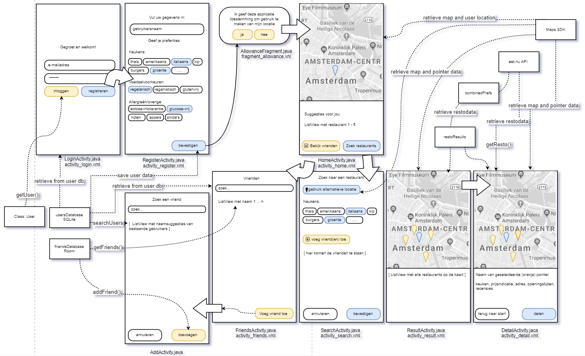

<h1>Design document</h1>

<h3>Advanced sketch</h3>

- First of all, when the user logs in or registers, the user instance is retrieved or created (and the user data will be loaded into the application)
- The usersDatabase will be used to store all the users of the application. Both in LoginActivity.java and RegisterActivity.java the userDatabase will be accessed.
The user data will be imported into the app and saved as a user class object instance. This class instance is used to make suggestions on HomeActivity.java
- There's a moment where the app asks permission to use the device's location. This boolean will be stored within the user instance.
- HomeActivity.java uses the Maps SDK to retrieve a map of the user's location including a pointer to indicate.

From HomeActivity.java there's a possibility to either see friends or `search for restaurants`.
- FriendsActivity.java displays all the friends of the user. These are retrieved from the friends database and inserted into a listview.
In this activity it's also possible to add a new friend. Which leads to;
- addActivity, where the user can search and add friends (other users). Once a friend is added, the friends database will be updated accordingly.

<h3>Diagram of modules, classes and functions</h3>

- Class(es): user, restaurant, combinedPrefs, restoResults | Databases: Users, Friends (as displayed above)

<h3>APIs and frameworks/plugins</h3>

- To `search for restaurants`, the API is eet.nu which contains a lot of data about restaurants like: location, kitchens, diets, ambience, reviews, opening hours and facilities is used.
  A function, retrieveRestoResults() retrieves restaurant results from the API (based on the user locations AND combined preferences)
  and in which it translates JSON formatted text into a restaurant class object
  This API also contains a "find restaurants near a geolocation" which will be used to search for nearby restaurants that meet de parameters.
-  A function, placePointers() which collects the altitudes and longitudes from the above retrieveRestoResults
  And places the locations on the map

<h3>Data sources</h3>

- The app will be using the Maps SDK using several overrides to make sure the connections is there and to
  find the user's location(s), this will happen in all the screens that require maps to display data (restaurant locations)

<h3>Database tables</h3>
Room databases consists out of three main components. The first component of Room is the Database, which contains all the data. The Entity component
makes it possible to change values (get and set field values). Last but not least, the Data Access Objects
(DAOs) that can get entities from the database or persist changes back to the database. 

The application uses two databases.

- One to store all the users of the app. This will be used to search and add friends (other users)
  There'll be a function that can 
- (temporarily) store the restaurants from retrieveRestoResults()
  And will be used to place a pointer on the map and display more details in a seperate textView.
  

