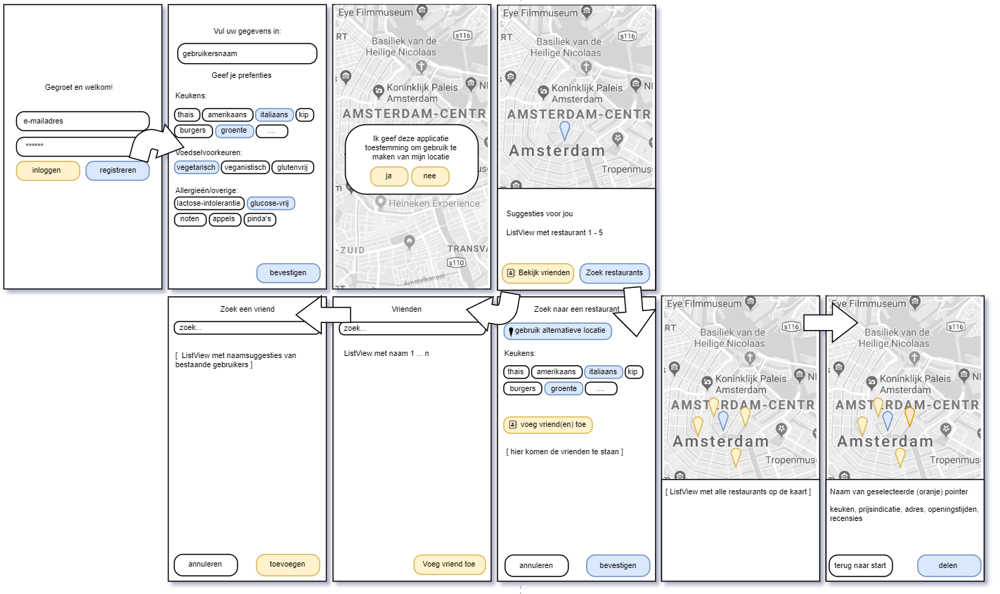

<h1>Project proposal</h1>
Summary: an application that helps finding the best restaurant suggestions based on multiple preferences. Made by: Rosan van der Werf 11030917

<h3>Problem statement</h3>
target audience: people that want to eat together but (problem:) don't really know what and where to eat. Furthermore, there's a lot food preferences like veganism, vegetarism or allergies/introlerances, which makes it hard to find a nice place that fits the needs and takes into account these preferences.

<h3>Solution</h3>
This app helps finding restaurant suggestions based on the user's location or a spcecified address, in which it also ensures it meets the preferences of the user self and the (when indicated) friend(s) the user wishes to eat with. 

Main features:
- Register as user and indicate food preferences
- Search, find and add other users as friends
- See the list of friends
- Suggest a search and request and fill in location, preferences, and other(s) to eat with
- Visualise on a map with pointers the possibilites where to eat
- When a pointer is clicked, details appear in the bottom of the screen
- (optional:) share the resaurant address/details via e.g. Whatsapp or as text or something

<h2>Prerequisites</h2>

Data sources:
- [Import Maps SDK](https://developers.google.com/maps/documentation/android-sdk/utility/) 
- [An API to request restaurants that meet the search filter](https://docs.eet.nu/)

External components:
- [Room, an alternate SQLite (for friends)](https://developer.android.com/training/data-storage/room)

Similar mobile apps:
- Google Maps
- Every food delivery app

Hardest parts:
- Implementing a map into the app, mostly because I have never done something like that before
- Work with an API with an unclear documentation, which makes it hard to request and receive the data needed
